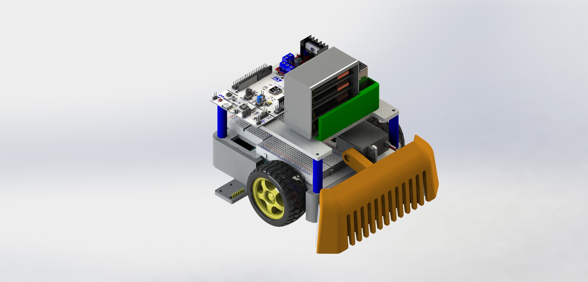
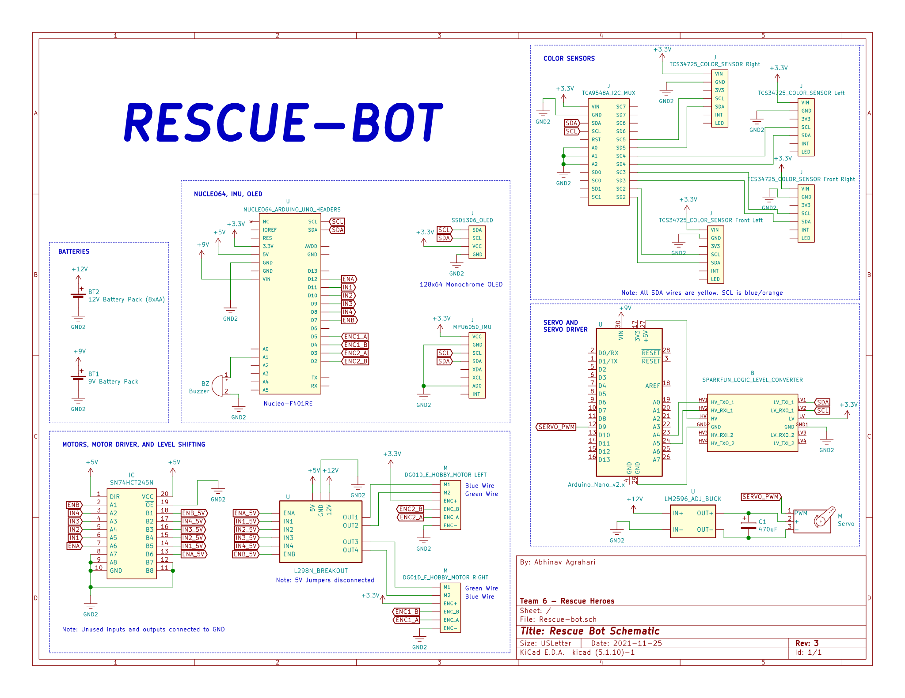

# Rescue-Bot
MTE 380 Rescue-Bot

> [Click here](https://youtu.be/ztVF_HEkW2k) for full Youtube video of our robot completing the search and rescue course!

# Renders

# Electrical Diagrams

- datasheets, high-level block diagram, KiCAD schematics

## Electrical Block Diagram
- `STM32F401RE` Nucleo board --> main microcontroller
- `Arduino Nano` --> Dedicated servo driver
- 4x `TCS34725` Color Sensors, multiplexed
- `MPU6050` IMU

## Schematic
Schematic made using KiCad

# Software
Firmware for our robot was written using PlatformIO, enabling Arduino framework for SMT32 Nucleo board.

Firmware for STM32 Nucleo board is located [here](./Software/Rescue-Bot). See it's README for more info about the STM32 project.

Data from various parts of the Search and Rescue course were collected with all color sensors, then plotted in 3D RGB space. Our color classification uses a Euclidean distance thresholding algorithim.

Motor encoder velocity readings are filted using a low-pass filter in software to turn this:

into a smoother reading:

# Mechanical Drawings

[PDF of all mechanical drawings](./images/Robot_Assembly_Drawing.pdf)

